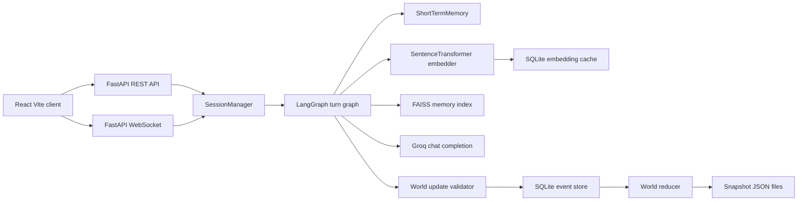

# The Obsidian Flask

## Table of contents

- [Quick start](#quick-start)
- [Project overview](#project-overview)
- [Problem statement](#problem-statement)
- [Project goals](#project-goals)
- [Key features](#key-features)
- [Supported use cases](#supported-use-cases)
- [System architecture](#system-architecture)
- [Architecture documentation](#architecture-documentation)
- [Application workflow](#application-workflow)
- [Technology stack](#technology-stack)
- [Repository structure](#repository-structure)
- [Prerequisites](#prerequisites)
- [Local installation](#local-installation)
- [Environment configuration](#environment-configuration)
- [Database and local data](#database-and-local-data)
- [Running the application](#running-the-application)
- [Available scripts and commands](#available-scripts-and-commands)
- [API documentation](#api-documentation)
- [Authentication and authorisation](#authentication-and-authorisation)
- [Input validation](#input-validation)
- [Error handling](#error-handling)
- [Logging](#logging)
- [Testing and verification](#testing-and-verification)
- [Build process](#build-process)
- [Docker deployment](#docker-deployment)
- [CI or CD process](#ci-or-cd-process)
- [Security considerations](#security-considerations)
- [Performance considerations](#performance-considerations)
- [Monitoring and maintenance](#monitoring-and-maintenance)
- [Repository metrics](#repository-metrics)
- [Troubleshooting](#troubleshooting)
- [Known limitations](#known-limitations)
- [Contribution guidelines](#contribution-guidelines)
- [Coding standards](#coding-standards)
- [Licence](#licence)
- [Support and contact information](#support-and-contact-information)

## Quick start

Run these commands from the repository root.

1. Configure local environment variables.

   ```powershell
   $env:GROQ_API_KEY = "gsk_replace_with_your_key"
   $env:SESSION_SECRET = "replace-with-a-long-random-local-secret"
   ```

   `GROQ_API_KEY` is needed for LLM gameplay. `SESSION_SECRET` has a generated fallback in code, but a fixed value is better for repeatable local runs.

2. Start the full local application.

   ```powershell
   npm run dev
   ```

   This runs frontend `npm install`, creates `.venv`, installs backend requirements into that `.venv`, starts backend and frontend in separate PowerShell windows, waits for both services, and then opens `http://localhost:8080`.

Expected result: the backend is ready on `http://127.0.0.1:8000/health`, the Vite frontend is ready on `http://localhost:8080`, and pressing `Ctrl+C` in the original terminal stops both services and closes the spawned terminals.

Common quick start errors:

| Problem                                     | Likely cause                                          | Resolution                                                                |
| ------------------------------------------- | ----------------------------------------------------- | ------------------------------------------------------------------------- |
| `npm run dev` cannot launch PowerShell      | Windows PowerShell is unavailable or blocked          | Run from a normal Windows terminal with `powershell.exe` on `PATH`        |
| First backend startup is slow               | ML packages or the embedding model are being cached   | Wait for setup to finish. Files are cached under `.cache` for later runs  |
| Frontend stays on the loading screen        | Backend `/health` is not ready                        | Check the backend terminal output and open `http://127.0.0.1:8000/health` |
| Action submission fails                     | Missing or invalid `GROQ_API_KEY`                     | Set `GROQ_API_KEY` before starting the backend                            |
| Character creation returns validation error | `age` is below `18` or required text fields are empty | Use a non empty name, gender, occupation, and age `18` or higher          |

## Project overview

The Obsidian Flask is a full stack text adventure game. The frontend is a React and TypeScript application. The backend is a FastAPI service that processes player actions through a LangGraph pipeline, calls Groq for NPC dialogue, validates proposed world changes, persists events in SQLite, and stores long term semantic memories in FAISS.

The game seed in [Backend/game/world_seed.json](Backend/game/world_seed.json) defines the title, initial narration, character options, locations, NPCs, objects, rules, player defaults, and starting relationships.

## Problem statement

LLM based dialogue games need memory, state control, and validation. Without these, an NPC can forget earlier turns, invent new facts, or mutate the world in a way that contradicts the canonical game state.

This project addresses that by combining:

- A canonical world seed.
- A validated event model.
- A deterministic reducer.
- Short term dialogue memory.
- FAISS based long term memory retrieval.
- A structured JSON output contract for the LLM.

## Project goals

- Let a player create a character and play a dark fantasy text adventure.
- Let NPCs respond through an LLM while keeping world updates constrained by code.
- Preserve sessions on disk with snapshots, dialogue history, event logs, and memory files.
- Provide a React UI for gameplay, world navigation, NPC relationship tracking, journal entries, and save loading.
- Keep local development runnable with PowerShell, npm, Python, and Docker files.

## Key features

- Character creation using gender and occupation options from the world seed.
- Main menu, new game screen, gameplay view, world view, NPC view, journal view, session loading view, and 404 page.
- Player actions sent to a FastAPI backend.
- LangGraph turn pipeline with input handling, memory retrieval, prompt assembly, LLM generation, JSON parsing, world validation, event commit, and output logging.
- Groq LLM client with configured timeout, retries, temperature, and token limit.
- Short term memory buffer of the last `8` turns.
- Long term memory using sentence transformer embeddings and FAISS CPU.
- SQLite append only event store per session.
- Snapshot and dialogue JSON files for auto saves and manual saves.
- Relationship, trust, emotional state, NPC switching, location travel, inventory pickup/drop, journal, and clue linking support.
- WebSocket endpoint for session connection, ping/pong, NPC response broadcast, and NPC switch broadcast.
- Dockerfiles for backend and frontend, plus a `docker-compose.yml` file.

## Supported use cases

- Local development of a FastAPI and React game.
- Testing narrative game state changes through an event reducer.
- Experimenting with RAG style NPC memory.
- Running the UI against the backend through Vite proxy routes.
- Building the frontend static bundle for nginx.
- Running both services through Docker Compose when Docker is available.

## System architecture



Main source files:

| Area                      | Source files                                                                                                   |
| ------------------------- | -------------------------------------------------------------------------------------------------------------- |
| Backend app factory       | [Backend/api/app.py](Backend/api/app.py)                                                                       |
| REST and WebSocket routes | [Backend/api/routes.py](Backend/api/routes.py)                                                                 |
| API schemas               | [Backend/api/schemas.py](Backend/api/schemas.py)                                                               |
| API presenters            | [Backend/api/presenters.py](Backend/api/presenters.py)                                                         |
| Session lifecycle         | [Backend/api/session_manager.py](Backend/api/session_manager.py)                                               |
| LangGraph pipeline        | [Backend/graph/definition.py](Backend/graph/definition.py)                                                     |
| Groq client               | [Backend/llm/groq_client.py](Backend/llm/groq_client.py)                                                       |
| Prompt builder            | [Backend/llm/prompt_builder.py](Backend/llm/prompt_builder.py)                                                 |
| World validation          | [Backend/game/validator.py](Backend/game/validator.py)                                                         |
| Event store and reducer   | [Backend/core/event_store.py](Backend/core/event_store.py), [Backend/core/reducer.py](Backend/core/reducer.py) |
| Frontend app routes       | [Frontend/src/App.tsx](Frontend/src/App.tsx)                                                                   |
| Frontend API contracts    | [Frontend/src/contracts/api.ts](Frontend/src/contracts/api.ts)                                                 |
| Frontend HTTP client      | [Frontend/src/services/httpClient.ts](Frontend/src/services/httpClient.ts)                                     |
| Frontend WebSocket client | [Frontend/src/services/websocket.ts](Frontend/src/services/websocket.ts)                                       |
| Frontend game store       | [Frontend/src/stores/gameStore.ts](Frontend/src/stores/gameStore.ts)                                           |

## Architecture documentation

The production architecture guide is [docs/architecture.md](docs/architecture.md). It defines dependency rules, data flows, extension points, failure handling, security considerations, operational guidance, and validation commands.

## Application workflow

1. The frontend starts and `BootGate` polls `/health` until the backend reports `ready: true`.
2. The app fetches metadata from `GET /api/game/metadata`.
3. A player creates a session through `POST /api/game/session`.
4. The backend loads the world seed, sets player metadata, creates a per session data directory, opens a SQLite event store, creates a FAISS memory index, creates short term memory, and builds the LangGraph graph.
5. The frontend refreshes state through `GET /api/game/state/{session_id}` and opens a WebSocket connection at `/ws/game/{session_id}`.
6. The player sends dialogue or commands through `POST /api/game/action/{session_id}`.
7. The backend retrieves memories, builds a prompt, calls Groq, extracts JSON, validates proposed updates, commits valid events, updates memory, saves the session, and returns dialogue plus state change details.
8. The frontend updates dialogue, relationships, inventory, current location, journal entries, clues, and save state from backend responses.

## Technology stack

Versions are taken from repository files and local verification output.

| Technology            | Version or range                                        | Purpose                         | Where used                                                  | Why it is needed                                                                       |
| --------------------- | ------------------------------------------------------- | ------------------------------- | ----------------------------------------------------------- | -------------------------------------------------------------------------------------- |
| Python                | `3.11` in `Backend/Dockerfile`, local `3.11.9` verified | Backend runtime                 | `Backend`                                                   | Runs FastAPI, LangGraph, persistence, embeddings, and LLM client code                  |
| Node.js               | `^20.19.0 or >=22.12.0`, local `24.15.0` verified       | Frontend runtime and build      | `Frontend/package.json`, `Frontend/Dockerfile`              | Required by Vite `8.1.5` and the React SWC plugin                                      |
| FastAPI               | `>=0.111,<1.0`                                          | HTTP and WebSocket API          | `Backend/api`                                               | Provides route decorators, request validation, CORS middleware, and OpenAPI generation |
| Pydantic              | `>=2.0,<3.0`                                            | Data validation                 | `Backend/api/schemas.py`, `Backend/schemas`                 | Defines API contracts, world state, event, and LLM output models                       |
| LangGraph             | `>=0.2,<1.0`                                            | Turn pipeline orchestration     | `Backend/graph/definition.py`                               | Runs the fixed graph from input to output                                              |
| Groq SDK              | `>=0.9.0`                                               | LLM provider client             | `Backend/llm/groq_client.py`                                | Sends prompts to the configured Groq model                                             |
| Sentence Transformers | `>=2.7,<4.0`                                            | Text embeddings                 | `Backend/memory/embedder.py`                                | Converts player input and memories to vectors                                          |
| PyTorch               | `>=2.2,<3.0`                                            | ML runtime                      | Backend embeddings                                          | Required by sentence transformers                                                      |
| FAISS CPU             | `>=1.7,<2.0`                                            | Vector search                   | `Backend/memory/faiss_index.py`                             | Retrieves semantically similar memories                                                |
| SQLite                | Python standard library                                 | Event store and embedding cache | `Backend/core/event_store.py`, `Backend/memory/embedder.py` | Stores events and cached vectors without a separate database server                    |
| React                 | `^18.3.1`                                               | UI framework                    | `Frontend/src`                                              | Renders the game interface                                                             |
| TypeScript            | `^5.8.3`                                                | Frontend typing                 | `Frontend/src`, config files                                | Provides typed API client, store, and UI code                                          |
| Vite                  | `^8.1.5`, build output used `8.1.5`                     | Dev server and build tool       | `Frontend/vite.config.ts`                                   | Serves local frontend and builds production assets                                     |
| Tailwind CSS          | `^3.4.17`                                               | Styling                         | `Frontend/src/index.css`, `Frontend/tailwind.config.ts`     | Provides utility classes and theme tokens                                              |
| Zustand               | `^5.0.11`                                               | Client state                    | `Frontend/src/stores`                                       | Stores session, game, and UI state                                                     |
| React Router DOM      | `^6.30.1`                                               | Frontend routing                | `Frontend/src/App.tsx`                                      | Defines menu, game, world, NPC, journal, session, and 404 routes                       |
| TanStack Query        | `^5.83.0`                                               | Server state provider           | `Frontend/src/App.tsx`                                      | Provides query client context                                                          |
| Framer Motion         | `^12.34.3`                                              | UI animation                    | Frontend pages and components                               | Animates loading, menu, and page elements                                              |
| nginx                 | `nginx:alpine`                                          | Static frontend server          | `Frontend/Dockerfile`, `Frontend/nginx.conf`                | Serves built frontend and proxies API and WebSocket routes in Docker                   |
| Docker Compose        | Compose file version `3.8`                              | Multi service local deployment  | `docker-compose.yml`                                        | Builds and connects backend and frontend containers                                    |

## Repository structure

```text
LLM-Game/
|-- Backend/
|   |-- api/
|   |   |-- app.py              # FastAPI factory, CORS, lifecycle, root health
|   |   |-- presenters.py       # Maps internal world state to API responses
|   |   |-- routes.py           # REST and WebSocket routes
|   |   |-- schemas.py          # API request and response models
|   |   `-- session_manager.py  # Session creation, loading, saving, shutdown
|   |-- core/
|   |   |-- event_store.py      # SQLite append only event store
|   |   |-- reducer.py          # Applies events to world state
|   |   `-- snapshot.py         # JSON snapshot save and load helpers
|   |-- game/
|   |   |-- validator.py        # Validates LLM proposed world updates
|   |   |-- world_loader.py     # Loads world seed JSON
|   |   `-- world_seed.json     # Canonical game world and metadata
|   |-- graph/
|   |   `-- definition.py       # LangGraph turn pipeline
|   |-- llm/
|   |   |-- groq_client.py      # Groq wrapper and JSON extraction
|   |   `-- prompt_builder.py   # Prompt construction
|   |-- memory/
|   |   |-- embedder.py         # Sentence transformer embedder and cache
|   |   |-- faiss_index.py      # FAISS memory index
|   |   `-- short_term.py       # Recent turn buffer
|   |-- schemas/
|   |   |-- events.py           # Event enum and payload helper models
|   |   |-- llm_output.py       # LLM JSON output schema
|   |   `-- world_state.py      # World state models
|   |-- tests/
|   |   `-- test_architecture.py # Import boundary and graph side effect tests
|   |-- config.py               # Backend configuration and environment loading
|   |-- Dockerfile              # Backend container image
|   |-- requirements.txt        # Backend dependencies
|   `-- server.py               # Uvicorn entry point
|-- Frontend/
|   |-- public/                 # Static favicon and Open Graph image
|   |-- src/
|   |   |-- components/         # Game, layout, and UI components
|   |   |-- config/             # Frontend constants
|   |   |-- contracts/          # Backend DTO contracts
|   |   |-- pages/              # Route pages
|   |   |-- services/           # HTTP client, WebSocket service, compatibility facade
|   |   |-- stores/             # Zustand stores
|   |   |-- test/               # Vitest setup
|   |   |-- types/              # Frontend TypeScript types
|   |   |-- App.tsx             # App shell and routes
|   |   |-- index.css           # Theme and global styles
|   |   `-- main.tsx            # React entry point
|   |-- Dockerfile              # Frontend build and nginx image
|   |-- nginx.conf              # nginx static serving and proxy rules
|   |-- package.json            # Frontend dependencies and scripts
|   |-- package-lock.json       # Locked npm dependency tree
|   |-- vite.config.ts          # Dev server and proxy config
|   `-- vitest.config.ts        # Vitest config
|-- docker-compose.yml          # Backend and frontend services
|-- docs/
|   `-- architecture.md         # Architecture, rules, operations, and validation guide
|-- package.json                # Root npm scripts for local dev and frontend build aliases
|-- scripts/
|   |-- dev.ps1                 # Root local setup and service orchestration
|   |-- dev-service.ps1         # Backend or frontend service window wrapper
|   |-- setup.ps1               # Idempotent repo-local dependency setup
|   `-- tooling-env.ps1         # Repo-local cache and tool environment helpers
|-- check.ps1                   # Full local validation script
|-- start.ps1                   # Compatibility wrapper around scripts/dev.ps1
`-- README.md                   # Project documentation
```

## Prerequisites

- Windows PowerShell for `npm run dev`, `start.ps1`, and separate service terminals.
- Python `3.11` or newer. Local verification used `3.11.9`.
- Node.js `^20.19.0 || >=22.12.0`. The frontend Docker build uses `node:22-alpine`; local verification used Node `24.15.0` and npm `11.12.1`.
- npm with support for `npm install`.
- Groq API key for LLM backed gameplay.
- Docker, only if using the Docker workflow. Docker was not available in the verification environment.

## Local installation

No separate install step is required for the normal local workflow.

```powershell
npm run dev
```

The root dev command performs the complete idempotent setup:

- Creates `.venv` in the repository root when missing.
- Installs `Backend\requirements.txt` only through `.venv\Scripts\python.exe`.
- Runs `npm install` in `Frontend`.
- Uses repo-local cache paths including `.cache\npm`, `.cache\pip`, `.cache\huggingface`, `.cache\torch`, and `.cache\pycache`.
- Uses `.codex-local\tmp` for runtime stop and failure signal files.

To run only setup without starting services:

```powershell
.\scripts\setup.ps1
```

Notes:

- The first run can take time because PyTorch, FAISS, and the sentence-transformers model are large.
- Repeated runs are safe. Existing installed packages and local caches are reused.
- `.\start.ps1` is still available and delegates to the same workflow.

## Environment configuration

Backend configuration is loaded in [Backend/config.py](Backend/config.py). The backend also calls `load_dotenv()`, so a local `.env` file can be used. `.env` files are ignored by `.gitignore`.

| Variable         | Required                         | Purpose                                 | Expected format      | Safe example                                | Default                               | Security notes                                                                                                  |
| ---------------- | -------------------------------- | --------------------------------------- | -------------------- | ------------------------------------------- | ------------------------------------- | --------------------------------------------------------------------------------------------------------------- |
| `GROQ_API_KEY`   | Required for LLM gameplay        | API key passed to the Groq SDK          | String secret        | `gsk_replace_with_your_key`                 | Empty string                          | Do not commit. Missing or invalid values break LLM generation.                                                  |
| `API_HOST`       | Optional                         | Backend bind host                       | Host or IP string    | `0.0.0.0`                                   | `0.0.0.0`                             | Binding to `0.0.0.0` exposes the server on all interfaces.                                                      |
| `API_PORT`       | Optional                         | Backend port                            | Integer string       | `8000`                                      | `8000`                                | Must match frontend proxy or deployment routing.                                                                |
| `FRONTEND_URL`   | Optional                         | Default CORS origin                     | URL                  | `http://localhost:8080`                     | `http://localhost:8080`               | Used as fallback when `CORS_ORIGINS` is absent.                                                                 |
| `CORS_ORIGINS`   | Optional                         | Allowed CORS origins                    | Comma separated URLs | `http://localhost:8080,http://localhost:80` | Value of `FRONTEND_URL`               | Keep narrow outside local development.                                                                          |
| `SESSION_SECRET` | Optional in code                 | Session secret value loaded into config | String secret        | `replace-with-random-secret`                | Random hex generated on process start | Loaded but not used elsewhere in the current repository. Use a stable secret if later session signing is added. |
| `DEBUG_ERRORS`   | Optional                         | Exposes internal exception details      | Boolean string       | `false`                                     | `false`                               | Keep false outside local debugging.                                                                             |
| `VITE_API_URL`   | Optional for frontend dev server | Backend target for Vite proxy           | URL                  | `http://localhost:8000`                     | `http://localhost:8000`               | Used only by `Frontend/vite.config.ts` during development. The runtime API base path is `/api/game`.            |
| `VITE_DEV_HOST`  | Optional for frontend dev server | Vite bind host                          | Host or IP string    | `localhost`                                 | `localhost`                           | Set to `0.0.0.0` only when LAN access is intended.                                                              |

Docker Compose passes these environment variables to the backend:

- `GROQ_API_KEY`
- `SESSION_SECRET`
- `CORS_ORIGINS`, with default `http://localhost:8080,http://localhost:80`

## Database and local data

There is no manual database setup and no migration command in the repository.

The backend creates local data on demand under `Backend/data`. This directory is ignored by git. For each session, the session manager creates:

| File                 | Purpose                      | Source                           |
| -------------------- | ---------------------------- | -------------------------------- |
| `events.db`          | SQLite event log             | `Backend/core/event_store.py`    |
| `faiss.index`        | FAISS vector index           | `Backend/memory/faiss_index.py`  |
| `faiss_meta.json`    | Metadata for FAISS entries   | `Backend/memory/faiss_index.py`  |
| `snapshot.json`      | Manual save snapshot         | `Backend/core/snapshot.py`       |
| `snapshot_auto.json` | Auto save snapshot           | `Backend/core/snapshot.py`       |
| `dialogue.json`      | Manual save dialogue history | `Backend/api/session_manager.py` |
| `dialogue_auto.json` | Auto save dialogue history   | `Backend/api/session_manager.py` |

The embedding cache is stored at `Backend/data/embed_cache.db`.

## Running the application

### Run with root npm

```powershell
npm run dev
```

What it does:

- Runs idempotent setup through [scripts/setup.ps1](scripts/setup.ps1).
- Starts the backend from `Backend` using `..\.venv\Scripts\python.exe -u server.py`.
- Starts the frontend from `Frontend` using `npm run dev`.
- Opens backend and frontend in separate PowerShell windows.
- Polls `http://127.0.0.1:8000/health` and `http://localhost:8080` for readiness.
- Opens `http://localhost:8080` only after both services are ready.
- Keeps the original terminal open as the process owner.

Windows behaviour:

- Press `Ctrl+C` in the original `npm run dev` terminal to stop both service processes and close the spawned terminal windows.
- If a previous run was interrupted, stale stop files under `.codex-local\tmp` are removed automatically on the next run.
- If ports `8000` or `8080` are occupied by this repository's previous service processes, they are stopped. If another application owns a port, startup fails instead of killing it.

### Run manually in two terminals

Manual runs are mainly useful for debugging. Run setup first:

```powershell
.\scripts\setup.ps1
```

Terminal 1, backend:

```powershell
. .\scripts\tooling-env.ps1
Set-RepoLocalToolingEnvironment -RootPath (Get-Location) | Out-Null
$env:GROQ_API_KEY = "gsk_replace_with_your_key"
$env:SESSION_SECRET = "replace-with-a-long-random-local-secret"
Push-Location Backend
..\.venv\Scripts\python.exe -u server.py
```

Expected result: backend logs show the API starting on `http://0.0.0.0:8000`.

Terminal 2, frontend:

```powershell
. .\scripts\tooling-env.ps1
Set-RepoLocalToolingEnvironment -RootPath (Get-Location) | Out-Null
Push-Location Frontend
npm --cache ..\.cache\npm run dev
```

Expected result: Vite serves the frontend on `http://localhost:8080` and proxies `/api`, `/health`, and `/ws` to the backend.

## Available scripts and commands

Root:

| Command                     | Where to run    | Purpose                                                                                             | Verification status                                                                   |
| --------------------------- | --------------- | --------------------------------------------------------------------------------------------------- | ------------------------------------------------------------------------------------- |
| `npm run dev`               | Repository root | Runs complete setup, starts both services in separate windows, and opens the browser                | Passed                                                                                |
| `npm run build`             | Repository root | Runs the existing frontend production build command                                                 | Source verified                                                                       |
| `npm run build:dev`         | Repository root | Runs the existing frontend development build command                                                | Source verified                                                                       |
| `npm run preview`           | Repository root | Runs the existing frontend preview command                                                          | Source verified                                                                       |
| `npm run check`             | Repository root | Runs `.\check.ps1`                                                                                  | Source verified                                                                       |
| `.\check.ps1`               | Repository root | Runs setup, backend syntax, backend tests, frontend format check, typecheck, lint, tests, and build | Passed                                                                                |
| `.\start.ps1`               | Repository root | Compatibility wrapper around `scripts\dev.ps1`                                                      | Source verified                                                                       |
| `docker compose up --build` | Repository root | Builds and runs backend plus frontend containers                                                    | Source verified from `docker-compose.yml`; not executed because Docker is unavailable |

Backend:

| Command                                                            | Where to run    | Purpose                                                         | Verification status                 |
| ------------------------------------------------------------------ | --------------- | --------------------------------------------------------------- | ----------------------------------- |
| `.\scripts\setup.ps1`                                              | Repository root | Creates `.venv` and installs backend plus frontend dependencies | Passed                              |
| `.\.venv\Scripts\python.exe -m compileall Backend`                 | Repository root | Checks backend Python syntax                                    | Passed                              |
| `.\.venv\Scripts\python.exe -m unittest discover -s Backend\tests` | Repository root | Runs backend architecture tests                                 | Passed                              |
| `.\.venv\Scripts\python.exe -u Backend\server.py`                  | Repository root | Starts FastAPI with Uvicorn                                     | Passed during workflow verification |

Frontend scripts from [Frontend/package.json](Frontend/package.json):

| Command                | Where to run | Purpose                                             | Verification status                                     |
| ---------------------- | ------------ | --------------------------------------------------- | ------------------------------------------------------- |
| `npm install`          | `Frontend`   | Installs dependencies                               | Passed through root setup                               |
| `npm run dev`          | `Frontend`   | Starts Vite dev server on port `8080`               | Source verified; not executed as a long running service |
| `npm run build`        | `Frontend`   | Builds production frontend bundle                   | Passed                                                  |
| `npm run build:dev`    | `Frontend`   | Builds frontend in development mode                 | Source verified                                         |
| `npm run lint`         | `Frontend`   | Runs ESLint                                         | Passed                                                  |
| `npm run preview`      | `Frontend`   | Serves the built frontend locally                   | Source verified                                         |
| `npm run test`         | `Frontend`   | Runs Vitest once                                    | Passed                                                  |
| `npm run test:watch`   | `Frontend`   | Runs Vitest in watch mode                           | Source verified                                         |
| `npm run typecheck`    | `Frontend`   | Runs TypeScript without emitting                    | Passed                                                  |
| `npm run format`       | `Frontend`   | Formats frontend files                              | Source verified                                         |
| `npm run format:check` | `Frontend`   | Checks frontend formatting                          | Source verified                                         |
| `npm run check`        | `Frontend`   | Runs format check, typecheck, lint, test, and build | Passed through `.\check.ps1`                            |

## API documentation

The backend exposes `18` HTTP endpoints and `1` WebSocket endpoint.

Base paths:

- Root health endpoint: `/health`
- Game API: `/api/game`
- WebSocket: `/ws/game/{session_id}`

All endpoints are unauthenticated in the current code.

### HTTP endpoints

| Method   | Route                                       | Purpose                                                                 | Request data                                            | Success response                                 | Common errors                                                 |
| -------- | ------------------------------------------- | ----------------------------------------------------------------------- | ------------------------------------------------------- | ------------------------------------------------ | ------------------------------------------------------------- |
| `GET`    | `/health`                                   | Root readiness check used by frontend boot gate                         | None                                                    | `{ "status": "ok", "ready": boolean }`           | `500` for unhandled errors                                    |
| `GET`    | `/api/game/metadata`                        | Reads game title, description, initial narration, and character options | None                                                    | `GameMetadataResponse`                           | Falls back to defaults if seed metadata cannot be read        |
| `POST`   | `/api/game/session`                         | Creates a new game session                                              | `CreateSessionRequest` JSON body                        | `SessionInfo`                                    | `422` validation error, `429` when max sessions reached       |
| `GET`    | `/api/game/sessions`                        | Lists saved manual and auto sessions                                    | None                                                    | Array of `SaveInfo`                              | Empty array when no saved sessions exist                      |
| `POST`   | `/api/game/load/{session_id}`               | Loads a saved session                                                   | Path `session_id`                                       | `SessionInfo`                                    | `404` if session is missing or corrupt                        |
| `POST`   | `/api/game/save/{session_id}`               | Saves the current session manually                                      | Path `session_id`                                       | `{ "status": "saved" }`                          | `404` if session is not active                                |
| `DELETE` | `/api/game/session/{session_id}`            | Destroys an active in memory session                                    | Path `session_id`                                       | `{ "status": "destroyed", "session_id": "..." }` | `404` if session is not active                                |
| `GET`    | `/api/game/state/{session_id}`              | Returns complete game state for a session                               | Path `session_id`                                       | `GameStateResponse`                              | `404` if session is not active                                |
| `POST`   | `/api/game/action/{session_id}`             | Processes player dialogue or command through the LLM pipeline           | `PlayerActionRequest` JSON body                         | `ActionResponse`                                 | `404` missing session, `422` invalid body, `500` engine error |
| `GET`    | `/api/game/npcs/{session_id}`               | Lists NPCs, optionally only in current location                         | Path `session_id`, query `location_only` default `true` | `NPCListResponse`                                | `404` if session is not active                                |
| `POST`   | `/api/game/npc/{session_id}/{npc_id}`       | Switches active NPC                                                     | Path `session_id`, `npc_id`                             | `{ "status": "switched", "npc": ... }`           | `404` missing NPC/session, `400` NPC not present or not alive |
| `GET`    | `/api/game/location/{session_id}`           | Gets current location data                                              | Path `session_id`                                       | `LocationInfo`                                   | `404` missing session or location                             |
| `GET`    | `/api/game/locations/{session_id}`          | Lists all locations in the world                                        | Path `session_id`                                       | Array of `LocationInfo`                          | `404` if session is not active                                |
| `POST`   | `/api/game/move/{session_id}`               | Moves player to a connected location                                    | `MoveRequest` JSON body                                 | `GameStateResponse`                              | `404` missing session, `400` invalid travel                   |
| `POST`   | `/api/game/clue/link/{session_id}`          | Links two clues                                                         | `LinkCluesRequest` JSON body                            | `GameStateResponse`                              | `404` missing session, `400` clue missing                     |
| `GET`    | `/api/game/health`                          | Game API health check and LLM reachability probe                        | None                                                    | `HealthResponse`                                 | LLM reachability is false if ping fails                       |
| `POST`   | `/api/game/pickup/{session_id}/{object_id}` | Adds object at current location to inventory                            | Path `session_id`, `object_id`                          | `GameStateResponse`                              | `404` missing session/object, `400` invalid pickup            |
| `POST`   | `/api/game/drop/{session_id}/{object_id}`   | Drops an inventory object at current location                           | Path `session_id`, `object_id`                          | `GameStateResponse`                              | `404` missing session, `400` object not in inventory          |

### Request models

`CreateSessionRequest`:

```json
{
	"name": "Asha",
	"gender": "Female",
	"age": 28,
	"occupation": "Scholar",
	"reset": false
}
```

Validation:

- `name`: minimum length `1`
- `gender`: minimum length `1`
- `age`: minimum `18`
- `occupation`: minimum length `1`
- `reset`: boolean, default `false`

`PlayerActionRequest`:

```json
{
	"content": "Ask Gareth what happened three nights ago.",
	"npc_id": "gareth_barkeep"
}
```

Validation:

- `content`: minimum length `1`, maximum length `2000`
- `npc_id`: optional string

`MoveRequest`:

```json
{
	"location_id": "tavern_cellar"
}
```

`LinkCluesRequest`:

```json
{
	"id1": "first_clue_id",
	"id2": "second_clue_id"
}
```

### Example API calls

Create a session:

```powershell
Invoke-RestMethod `
  -Method Post `
  -Uri "http://localhost:8000/api/game/session" `
  -ContentType "application/json" `
  -Body '{"name":"Asha","gender":"Female","age":28,"occupation":"Scholar","reset":false}'
```

Send a player action:

```powershell
Invoke-RestMethod `
  -Method Post `
  -Uri "http://localhost:8000/api/game/action/<session_id>" `
  -ContentType "application/json" `
  -Body '{"content":"Ask about Vane.","npc_id":"gareth_barkeep"}'
```

### WebSocket endpoint

Route:

```text
WS /ws/game/{session_id}
```

Incoming messages:

```json
{ "type": "ping", "payload": {} }
```

```json
{ "type": "action", "payload": { "content": "Look around." } }
```

Outgoing message types:

- `connected`
- `pong`
- `npc_response`
- `state_update`
- `npc_switched`
- `error`

If the session is missing, the server closes the WebSocket with code `4004`.

## Authentication and authorisation

No authentication or authorisation is implemented in the current repository.

Implications:

- Any caller who can reach the backend can create sessions, send actions, load saves, list saves, and destroy active sessions.
- `SESSION_SECRET` is loaded in configuration but is not used elsewhere in the current code.
- Do not expose this backend to an untrusted network without adding authentication and access control.

## Input validation

Validation is implemented in three layers:

| Layer                       | Source                      | Behaviour                                                                                                                                                        |
| --------------------------- | --------------------------- | ---------------------------------------------------------------------------------------------------------------------------------------------------------------- |
| API request validation      | `Backend/api/schemas.py`    | Pydantic validates body fields, minimum lengths, age, and action length                                                                                          |
| Route level checks          | `Backend/api/routes.py`     | Checks active sessions, NPC availability, location connectivity, object ownership, and clue existence                                                            |
| LLM world update validation | `Backend/game/validator.py` | Rejects unknown event types, non canonical entities, invalid movement, impossible inventory actions, excessive relationship deltas, and invalid currency changes |

The LLM is instructed to return a strict JSON object. The backend parses this JSON and validates it before applying world changes.

## Error handling

- FastAPI validation errors return standard `422` responses.
- Missing sessions and missing entities return route level `404` or `400` errors.
- The global exception handler in `Backend/api/app.py` logs unhandled exceptions server side and hides details unless `DEBUG_ERRORS=true`.
- `GroqClient.generate()` retries failed generation calls. Rate limit style errors use exponential backoff.
- The frontend API client converts FastAPI validation details into readable error messages through `APIError`.
- WebSocket invalid JSON returns an `error` message instead of closing the socket.

## Logging

Backend logging:

- Configured in `Backend/server.py`.
- Request logging middleware records method, path, status code, and elapsed time.
- Session startup, shutdown, resource loading, LLM errors, validation warnings, and turn completion are logged.

Frontend logging:

- API, WebSocket, session, and game store errors are logged through `console.error`.
- User facing notifications use `sonner` toast messages.

No external log collector or metrics exporter is configured in the repository.

## Testing and verification

Verification run in this workspace:

| Check                    | Command                                                            | Result                                                               |
| ------------------------ | ------------------------------------------------------------------ | -------------------------------------------------------------------- |
| Python version           | `python --version`                                                 | Passed, `Python 3.11.9`                                              |
| Node version             | `node --version`                                                   | Passed, `v24.15.0`                                                   |
| npm version              | `npm --version`                                                    | Passed, `11.12.1`                                                    |
| Repo-local setup         | `.\scripts\setup.ps1`                                              | Passed                                                               |
| Frontend install         | `npm install` in `Frontend`                                        | Passed through root setup                                            |
| Dependency audit         | `npm audit` in `Frontend`                                          | Passed, `0` vulnerabilities                                          |
| Backend syntax           | `.\.venv\Scripts\python.exe -m compileall Backend`                 | Passed                                                               |
| Backend tests            | `.\.venv\Scripts\python.exe -m unittest discover -s Backend\tests` | Passed, `2` tests                                                    |
| Frontend format check    | `npm run format:check` in `Frontend`                               | Passed                                                               |
| Frontend typecheck       | `npm run typecheck` in `Frontend`                                  | Passed                                                               |
| Frontend lint            | `npm run lint` in `Frontend`                                       | Passed                                                               |
| Frontend tests           | `npm run test` in `Frontend`                                       | Passed, `4` tests                                                    |
| Frontend build           | `npm run build` in `Frontend`                                      | Passed                                                               |
| Full local dev workflow  | `npm run dev -- -ReadyTimeoutSeconds 120`                          | Passed, browser opened after readiness and `Ctrl+C` stopped services |
| Full validation workflow | `.\check.ps1`                                                      | Passed                                                               |
| Docker Compose config    | `docker compose config`                                            | Not run because Docker is unavailable                                |

Test coverage:

```text
Not measured. Current tests cover backend architecture boundaries and frontend HTTP client behaviour.
```

## Build process

Frontend production build:

```powershell
npm run build
```

The root command delegates to the existing `Frontend` build script. Running `npm run build` inside `Frontend` is still supported.

Verified output:

| Asset                            | Size        | Gzip size   |
| -------------------------------- | ----------- | ----------- |
| `dist/index.html`                | `1.24 kB`   | `0.55 kB`   |
| `dist/assets/index-Crp1Bm5M.css` | `29.57 kB`  | `6.53 kB`   |
| `dist/assets/index-Bble0lqD.js`  | `485.88 kB` | `151.32 kB` |

Verified build time:

```text
895ms
```

Backend build:

- There is no separate backend build step.
- The backend is run directly through Python or built into the Docker image.

## Docker deployment

Docker files:

- [Backend/Dockerfile](Backend/Dockerfile)
- [Frontend/Dockerfile](Frontend/Dockerfile)
- [Frontend/nginx.conf](Frontend/nginx.conf)
- [docker-compose.yml](docker-compose.yml)

Run with Docker Compose:

```powershell
$env:GROQ_API_KEY = "gsk_replace_with_your_key"
$env:SESSION_SECRET = "replace-with-a-long-random-secret"
docker compose up --build
```

Expected ports from `docker-compose.yml`:

| Service  | Host port | Container port |
| -------- | --------- | -------------- |
| Backend  | `8000`    | `8000`         |
| Frontend | `8080`    | `80`           |

The frontend nginx container proxies:

- `/api/` to `http://backend:8000/api/`
- `/ws/` to `http://backend:8000/ws/`
- `/health` to `http://backend:8000/health`

Persistent backend data:

```text
./Backend/data:/app/data
```

Docker verification status:

```text
Not executed in this environment because Docker is not installed or not on PATH.
```

## CI or CD process

No CI or CD configuration is present in the current repository. No `.github/workflows` files were found in the tracked file list.

## Security considerations

- Keep `GROQ_API_KEY` and `SESSION_SECRET` out of git.
- `.env` and `.env.*` are ignored by `.gitignore`.
- No authentication or authorisation is implemented.
- CORS is configurable through `CORS_ORIGINS`; keep it narrow outside local development.
- Unhandled exception details are hidden by default. Use `DEBUG_ERRORS=true` only for local debugging.
- Vite binds to `localhost` by default. Use `VITE_DEV_HOST` only when LAN access is intended.
- The backend accepts player text and sends it to an LLM. Treat player input as untrusted.
- LLM world changes are validated before being applied, but LLM dialogue text is still model generated content.
- `npm audit` currently reports `0` vulnerabilities.
- There is no rate limiting in the current API code.

## Performance considerations

Verified configuration values:

| Setting                                      | Value                                     | Source                                                  |
| -------------------------------------------- | ----------------------------------------- | ------------------------------------------------------- |
| LLM model                                    | `openai/gpt-oss-120b`                     | `Backend/config.py`                                     |
| LLM temperature                              | `0.35`                                    | `Backend/config.py`                                     |
| LLM max generation tokens                    | `4096`                                    | `Backend/config.py`                                     |
| LLM request timeout                          | `30` seconds                              | `Backend/config.py`                                     |
| LLM max retries                              | `3`                                       | `Backend/config.py`                                     |
| LLM retry backoff                            | `1.0` second                              | `Backend/config.py`                                     |
| Embedding model                              | `sentence-transformers/all-MiniLM-L12-v2` | `Backend/config.py`                                     |
| Embedding dimension                          | `384`                                     | `Backend/config.py`                                     |
| Short term turns                             | `8`                                       | `Backend/config.py`                                     |
| FAISS top K retrieval                        | `6`                                       | `Backend/config.py`                                     |
| FAISS overfetch factor                       | `5`                                       | `Backend/config.py`                                     |
| Retrieval minimum candidates before fallback | `3`                                       | `Backend/config.py`                                     |
| Snapshot interval                            | Every `16` turns                          | `Backend/config.py`                                     |
| Memory prune threshold                       | `1000` entries                            | `Backend/config.py`                                     |
| Memory prune keep ratio                      | `0.5`                                     | `Backend/config.py`                                     |
| Max context characters                       | `16384`                                   | `Backend/config.py`                                     |
| WebSocket heartbeat interval                 | `30` seconds backend, `30000` ms frontend | `Backend/config.py`, `Frontend/src/config/constants.ts` |
| Frontend WebSocket reconnect attempts        | `5`                                       | `Frontend/src/config/constants.ts`                      |

Performance metrics such as request latency distribution, throughput, memory usage, and concurrent WebSocket capacity have not been measured in the current repository.

## Monitoring and maintenance

Available runtime checks:

- `GET /health` checks backend readiness.
- `GET /api/game/health` checks API status, LLM reachability, active session count, and readiness.
- Backend logs include request latency in milliseconds.
- Session data can be inspected under `Backend/data/sessions`.

Maintenance tasks:

- Run `.\check.ps1` before submitting changes.
- Run `npm audit` after frontend dependency changes.
- Rotate any leaked local secrets immediately if they were ever committed.
- Back up `Backend/data` if local save files matter.

## Repository metrics

| Metric                                  | Verified value                            | Source or command                                                  | Notes                                                                           |
| --------------------------------------- | ----------------------------------------- | ------------------------------------------------------------------ | ------------------------------------------------------------------------------- |
| Total tracked files from source listing | `93`                                      | `rg --files`                                                       | Excludes ignored generated directories                                          |
| Backend files                           | `33`                                      | `rg --files Backend`                                               | Includes Python, JSON, Docker, requirements, and tests                          |
| Frontend files                          | `50`                                      | `rg --files Frontend`                                              | Includes source, config, public assets, package files, Docker, and nginx config |
| HTTP endpoints                          | `18`                                      | `rg` over `Backend\api` route decorators                           | Includes root `/health` and `/api/game` endpoints                               |
| WebSocket endpoints                     | `1`                                       | Same command                                                       | `/ws/game/{session_id}`                                                         |
| React route paths                       | `8`                                       | `rg "Route path=" Frontend\src\App.tsx`                            | Includes wildcard 404 route                                                     |
| Frontend pages                          | `8`                                       | `rg --files Frontend\src\pages`                                    | Page component files                                                            |
| Frontend components                     | `10`                                      | `rg --files Frontend\src\components`                               | Game, layout, and UI components                                                 |
| Frontend Zustand stores                 | `2`                                       | `rg --files Frontend\src\stores`                                   | Game and UI stores                                                              |
| Frontend npm scripts                    | `11`                                      | `Frontend/package.json`                                            | Includes `check`, `typecheck`, format scripts, lint, test, and build            |
| Backend dependency entries              | `15`                                      | `Backend/requirements.txt`                                         | Non empty dependency lines                                                      |
| World locations                         | `8`                                       | `Backend/game/world_seed.json`                                     | Canonical seed data                                                             |
| NPCs                                    | `4`                                       | `Backend/game/world_seed.json`                                     | Canonical seed data                                                             |
| Objects                                 | `4`                                       | `Backend/game/world_seed.json`                                     | Canonical seed data                                                             |
| World rules                             | `7`                                       | `Backend/game/world_seed.json`                                     | Canonical seed data                                                             |
| Gender options                          | `4`                                       | `Backend/game/world_seed.json`                                     | Character creation metadata                                                     |
| Occupation options                      | `5`                                       | `Backend/game/world_seed.json`                                     | Character creation metadata                                                     |
| Test files                              | `2`                                       | `rg --files Backend\tests Frontend\src`                            | Backend architecture tests and frontend HTTP client tests                       |
| Test coverage percentage                | `Not measured in the current repository.` | Not available                                                      | No coverage tooling output is present                                           |
| Default backend port                    | `8000`                                    | `Backend/config.py`, `docker-compose.yml`                          | Local and Docker                                                                |
| Default frontend port                   | `8080`                                    | `Frontend/vite.config.ts`, `docker-compose.yml`, `scripts/dev.ps1` | Local Vite and Docker host port                                                 |
| Build time                              | `895ms`                                   | `npm run build`                                                    | Local verification result                                                       |
| JS bundle gzip size                     | `151.32 kB`                               | `npm run build`                                                    | Local verification result                                                       |
| CSS bundle gzip size                    | `6.53 kB`                                 | `npm run build`                                                    | Local verification result                                                       |

## Troubleshooting

| Problem                                  | Likely cause                                         | Diagnostic command                                                    | Resolution                                                                          |
| ---------------------------------------- | ---------------------------------------------------- | --------------------------------------------------------------------- | ----------------------------------------------------------------------------------- |
| `npm run dev` cannot launch services     | PowerShell is unavailable or blocked                 | `powershell.exe -NoProfile -Command "$PSVersionTable.PSVersion"`      | Run from a Windows terminal with `powershell.exe` available                         |
| First setup run is slow                  | Large ML dependencies or embedding model download    | Check `.cache\pip` and `.cache\huggingface`                           | Let the setup finish. Later runs reuse the repository-local caches                  |
| Backend import or package error          | Backend dependencies not installed in `.venv`        | `.\.venv\Scripts\python.exe -m pip show fastapi`                      | Run `.\scripts\setup.ps1` from the repository root                                  |
| Frontend command not found               | Dependencies missing                                 | `Test-Path Frontend\node_modules`                                     | Run `npm run dev` or `.\scripts\setup.ps1` from the repository root                 |
| Frontend loading screen does not proceed | Backend health endpoint not ready                    | `Invoke-RestMethod http://127.0.0.1:8000/health`                      | Start backend and wait for shared resources to load                                 |
| Groq generation fails                    | Missing or invalid API key                           | `$env:GROQ_API_KEY`                                                   | Set `GROQ_API_KEY` before starting backend                                          |
| Session creation returns `422`           | Invalid request body                                 | Check browser network response                                        | Provide all required fields and use age `18` or higher                              |
| Travel returns `400`                     | Target location is not connected to current location | `Invoke-RestMethod http://127.0.0.1:8000/api/game/state/<session_id>` | Travel only to a location listed in `connected_to`                                  |
| `.\check.ps1` fails                      | One validation step failed                           | Read the first failed command in the output                           | Fix that command locally, then rerun `.\check.ps1`                                  |
| `npm audit` reports findings             | Dependency advisory in the current lockfile          | `cd Frontend; npm audit`                                              | Prefer non breaking updates first, then validate major updates with `npm run check` |
| Docker command fails                     | Docker not installed or unavailable                  | `docker --version`                                                    | Install Docker Desktop or use the local PowerShell workflow                         |

## Known limitations

- No authentication or authorisation is implemented.
- Backend tests currently cover architecture boundaries, not full gameplay integration.
- Frontend tests currently cover the HTTP client, not route level rendering or WebSocket flows.
- Docker files exist, but Docker could not be executed in the verification environment.
- `SESSION_SECRET` is loaded but not used elsewhere in the current code.
- Some performance metrics are not measured, including request throughput, memory usage, and production latency.
- The source contains some non ASCII characters in comments and UI text. This README is ASCII only.

## Contribution guidelines

1. Create a branch for each change.
2. Keep changes focused on one issue.
3. Update or add tests when changing behaviour.
4. Run the relevant checks before submitting changes:

   ```powershell
   .\check.ps1
   ```

5. Document new environment variables, endpoints, scripts, and data files in this README.
6. Do not commit secrets, generated data, `node_modules`, `dist`, `.venv`, or `Backend/data`.

## Coding standards

Backend:

- Use Python type hints where practical.
- Keep world mutations represented as events.
- Validate LLM proposed changes before applying them.
- Keep schema changes reflected in Pydantic models.
- Use logging for operational events and failures.

Frontend:

- Use TypeScript for API contracts, store state, and components.
- Keep REST calls in `Frontend/src/services/httpClient.ts`.
- Keep WebSocket lifecycle logic in `Frontend/src/services/websocket.ts`.
- Keep backend DTOs in `Frontend/src/contracts/api.ts`.
- Keep shared client state in Zustand stores.
- Use the existing path alias `@/*`.
- Follow the existing tab based formatting. `Frontend/.prettierrc.json` sets `useTabs: true` and `tabWidth: 2`.

## Licence

No licence file is present in the current repository. Usage, distribution, and modification rights are not specified.

## Support and contact information

No support channel or maintainer contact is specified in the current repository.
